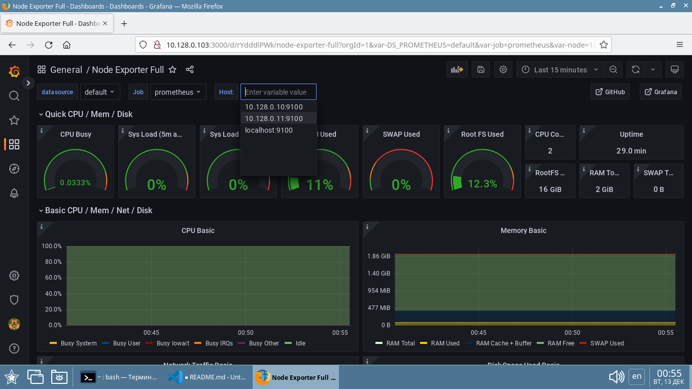

# Домашнее задание к занятию "9.4. Prometheus" - `Елена ^..^`

- [Ответ к Заданию 1](#1)
- [Ответ к Заданию 2](#2)
- [Ответ к Заданию 3](#3)
- [Ответ к Заданию 4*](#4)
- [Ответ к Заданию 5*](#5)

---

### Задание 1. 

Установите Prometheus.

*Приведите скриншот systemctl status prometheus, где будет написано prometheus.service - Prometheus Service Netology Lesson 9.4 - [Ваши ФИО]*

### *<a name="1">Ответ к Заданию 1</a>*

[/terraform/prometheus.sh](terraform/prometheus.sh)

[/terraform/prometheus.service](terraform/prometheus.service)

```bash
#!/bin/bash

# Создаем пользователя Prometheus:
sudo useradd --no-create-home --shell /bin/false prometheus

# Скачиваем архив Prometheus:
wget https://github.com/prometheus/prometheus/releases/download/v2.40.1/prometheus-2.40.1.linux-386.tar.gz

# Распаковываем и копируем файлы в нужные дирректории:
tar xvfz prometheus-2.40.1.linux-386.tar.gz 
sudo mkdir /etc/prometheus
sudo mkdir /var/lib/prometheus
sudo cp /home/user/prometheus-2.40.1.linux-386/prometheus  /usr/local/bin/
sudo cp /home/user/prometheus-2.40.1.linux-386/promtool  /usr/local/bin/
sudo cp -R /home/user/prometheus-2.40.1.linux-386/console_libraries /etc/prometheus
sudo cp -R /home/user/prometheus-2.40.1.linux-386/consoles /etc/prometheus
sudo cp /home/user/prometheus-2.40.1.linux-386/prometheus.yml /etc/prometheus

# Передаем права на файлы пользователю prometheus:
sudo chown -R prometheus:prometheus /etc/prometheus 
sudo chown -R prometheus:prometheus /var/lib/prometheus
sudo chown prometheus:prometheus /usr/local/bin/prometheus
sudo chown prometheus:prometheus /usr/local/bin/promtool

# Запускаем и проверяем результат
#/usr/local/bin/prometheus --config.file /etc/prometheus/prometheus.yml --storage.tsdb.path /var/lib/prometheus/ --web.console.templates=/etc/prometheus/consoles --web.console.libraries=/etc/prometheus/console_libraries

#Создаем сервис для работы с Prometheus

sudo cp /home/user/prometheus/prometheus.service /etc/systemd/system/prometheus.service

#Запуск сервиса
sudo systemctl enable prometheus
sudo systemctl start prometheus
#sudo systemctl status prometheus


#Можно проверить, что всё работает, перейдя по адресу: http://<ip_сервера>:9090

#Добавление Node Exporter в Prometheus
sudo sed -i '/9090/d' /etc/prometheus/prometheus.yml
cat /home/user/prometheus/targets | sudo tee -a /etc/prometheus/prometheus.yml

# Перезапустите Prometheus
sudo systemctl restart prometheus 

#Можно проверить, что всё работает, перейдя по адресу: http://<ip_сервера>:9090/targets
```


---

### Задание 2. 

Установите Node Exporter.

*Приведите скриншот systemctl status node-exporter, где будет написано node-exporter.service - Node Exporter Netology Lesson 9.4 - [Ваши ФИО]*

### *<a name="2">Ответ к Заданию 2</a>*

[/terraform/node_exporter.sh](terraform/node_exporter.sh)

[/terraform/node-exporter.service](terraform/node-exporter.service)

```bash
#!/bin/bash

# Создаем пользователя Prometheus:
sudo useradd --no-create-home --shell /bin/false prometheus

#Скачиваем архив и распоковываем
wget https://github.com/prometheus/node_exporter/releases/download/v1.4.0/node_exporter-1.4.0.linux-amd64.tar.gz 
tar xvfz /home/user/node_exporter-1.4.0.linux-amd64.tar.gz

#Копируем Node Explorer в папку Prometheus
sudo mkdir /etc/prometheus
sudo mkdir /etc/prometheus/node-exporter
sudo cp -r /home/user/node_exporter-1.4.0.linux-amd64/* /etc/prometheus/node-exporter

#Передаем права
sudo chown -R prometheus:prometheus /etc/prometheus/node-exporter/

#Создаем службу
sudo cp /home/user/prometheus/node-exporter.service  /etc/systemd/system/node-exporter.service
sudo chown -R prometheus:prometheus /etc/prometheus/node-exporter/

#Запуск службы
sudo systemctl enable node-exporter
sudo systemctl start node-exporter
#sudo systemctl status node-exporter -d


#Можно проверить, что всё работает, перейдя по адресу: http://<ip_сервера>:9100/metrics  

```


---

### Задание 3. 

Подключите Node Exporter к серверу Prometheus.

*Приложите скриншот конфига из интерфейса Prometheus вкладки Status > Configuration*
*Приложите скриншот из интерфейса Prometheus вкладки Status > Targets, чтобы было видно минимум два эндпоинта*

### *<a name="3">Ответ к Заданию 3</a>*


---
## Дополнительные задания (со звездочкой*)

Эти задания дополнительные (не обязательные к выполнению) и никак не повлияют на получение вами зачета по этому домашнему заданию. Вы можете их выполнить, если хотите глубже и/или шире разобраться в материале.

---

### Задание 4*. 

Установите Grafana.

*Приложите скриншот левого нижнего угла интерфейса, чтобы при наведении на иконку пользователя были видны ваши ФИО*

### *<a name="4">Ответ к Заданию 4</a>*

[/terraform/grafana.sh](terraform/grafana.sh)

```bash
#!/bin/bash

# Установка Grafana
wget https://dl.grafana.com/oss/release/grafana_9.2.4_amd64.deb
sudo dpkg -i grafana_9.2.4_amd64.deb
sudo apt-get install libfontconfig1 fontconfig-config fonts-dejavu-core

# Включите автозапуск и запускаем сервер Grafana:

sudo systemctl enable grafana-server 
sudo systemctl start grafana-server 
# sudo systemctl status grafana-server

# Проверьте статус подключившись на адрес: 
# https://<наш сервер>:3000
# Стандартный логин и пароль admin \ admin

```


---

### Задание 5*. 

Интегрируйте Grafana и Prometheus.

*Приложите скриншот дашборда (ID:11074) с поступающими туда данными из Node Exporter*

### *<a name="5">Ответ к Заданию 5</a>*




### Terraform

C использованием [terraform](terraform/main_prometheus_sh.tf) создание 3 машин (сервера с установленными prometheus, node-exporter, grafana и двух хостов с node-exporter) заняло менее 10 минут.


```HCL
// Create several similar vm 

// Configure the Yandex Cloud provider

terraform {
  required_providers {
    yandex = {
      source = "yandex-cloud/yandex"
    }
  }
}

provider "yandex" {
  token     = var.OAuthTocken
  cloud_id  = "b1gob4asoo1qa32tbt9b"
  folder_id = "b1gob4asoo1qa32tbt9b"
  zone      = "ru-central1-a"
}


  
//create vm

resource "yandex_compute_instance" "vm" {
  name = "${var.guest_name_prefix}-vm0${count.index + 1}" #variables.tf 
  count = 2


  resources {
    cores     = 2
    memory    = 2
  
  }

  boot_disk {
    initialize_params {
      image_id = "fd8456n7d102l8p6ipgl" #Debian 11
      type     = "network-ssd"
      size     = "16"
    }
  }

  network_interface {
    subnet_id = "e9bf0qhr78eltofkhvbb"
    nat       = true
    ip_address     = lookup(var.vm_ips, count.index) #terraform.tfvars
    }

  
  metadata = {
    user-data = "${file("./meta.txt")}"
  }

  scheduling_policy {
    preemptible = true
  }

  # Copy in the bash script we want to execute.
  # The source is the location of the bash script
  # on the local linux box you are executing terraform
  # from.  The destination is on the new  instance.
  provisioner "file" {
    source      = "/home/user/terraform/checked-versions/prometheus"
    destination = "/home/user/prometheus"
  }  
  
  connection {
    host = lookup(var.vm_ips, count.index) #terraform.tfvars
    type        = "ssh"
    private_key = "${file("~/.ssh/id_rsa")}"
    port        = 22
    user        = "user"
    agent       = false
    timeout     = "1m"
  }

  # Change name and install Node Exporter on bash script and execute from user.

  provisioner "remote-exec" {
    
    inline = [
      "sudo hostnamectl set-hostname ${var.guest_name_prefix}-vm0${count.index + 1}",
      "sudo sed -i '$a127.0.0.1 ${var.guest_name_prefix}-vm0${count.index + 1}' /etc/hosts",
      "chmod +x /home/user/prometheus/node_exporter.sh",
      "sudo /home/user/prometheus/node_exporter.sh",
    ]  
  }
}

resource "yandex_compute_instance" "makhota-prometheus" {
  name = "makhota-prometheus" 


  resources {
    cores     = 4
    memory    = 4
  
  }

  boot_disk {
    initialize_params {
      image_id = "fd8456n7d102l8p6ipgl" #Debian 11
      type     = "network-ssd"
      size     = "16"
    }
  }

  network_interface {
    subnet_id = "e9bf0qhr78eltofkhvbb"
    nat       = true
    ip_address     = "10.128.0.103"
    }

  
  metadata = {
    user-data = "${file("./meta.txt")}"
  }

  scheduling_policy {
    preemptible = true
  }

  # Copy in the bash script we want to execute.
  # The source is the location of the bash script
  # on the local linux box you are executing terraform
  # from.  The destination is on the new  instance.
  provisioner "file" {
    source      = "/home/user/terraform/checked-versions/prometheus"
    destination = "/home/user/prometheus"
  }  
  
  connection {
    host = "10.128.0.103"
    type        = "ssh"
    private_key = "${file("~/.ssh/id_rsa")}"
    port        = 22
    user        = "user"
    agent       = false
    timeout     = "1m"
  }

  # Change name and permissions on bash script and execute from user.

  provisioner "remote-exec" {
    
    inline = [
      "sudo hostnamectl set-hostname makhota-prometheus",
      "sudo sed -i '$a127.0.0.1 makhota-prometheus' /etc/hosts",
      "chmod +x /home/user/prometheus/prometheus.sh",
      "sudo /home/user/prometheus/prometheus.sh",
      "chmod +x /home/user/prometheus/node_exporter.sh",
      "sudo /home/user/prometheus/node_exporter.sh",
      "chmod +x /home/user/prometheus/grafana.sh",
      "sudo /home/user/prometheus/grafana.sh",
    ]  
  }
}
```


